# 이력서

## 소개
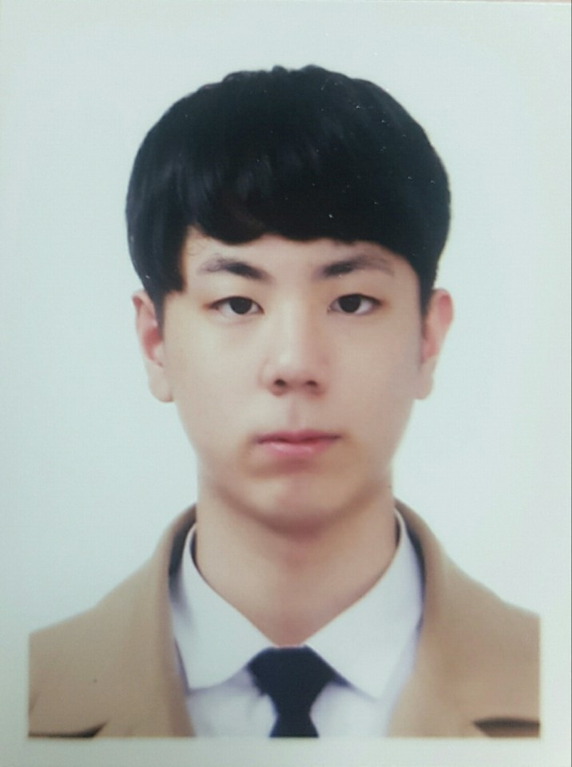</img>
- 이름 : 이태준
- Email : ltjbs2020@gmail.com
- Github : https://github.com/CBorange
- 병역 : 현재 산업기능요원 복무중입니다.
- 사용 기술 : **C#/WinForm/WPF/Unity3D**, **C++/MFC/DirectX**

내가 작성한 코드는 언제든지 상황에 따라서 수정될 수 있다고 생각합니다.   
항상 추가/수정이 용이한 코드를 작성할 수 있도록 노력합니다.

## 학력
- 한세사이버보안고등학교 **게임과** 졸업 (2016.03~2019.02)

## 회사 경력
- **디지털존** 응용프로그램 개발팀 근무 (2019.01~2019.07)
  - KIOSK 전자증명서 발급 서비스 개발(**Unity3D**)
  - 풋볼 팬타지움 가상 유니폼 피팅 서비스 개발&유지보수(**Unity3D**)
  - 전통문화사업 연구개발 프로젝트 : 전형지원 시험 프로그램 개발(**Unity3D**)
  - 전통문화사업 연구개발 프로젝트 : 전형지원 뷰어 프로그램 개발(**WPF**)
- **하이컴텍** TF팀 근무 (20220-07~)
  - 건축 견적/공사 관리 솔루션 커튼월 프로그램 개발(**C#/Winform**)
  - 건축자재 재단 솔루션 프로그램 개발(**C++/MFC**)
  - 솔루션 프로그램 실행 런처 개발(**C#/C++**)

### KIOSK 전자증명서 발급 서비스
</img>   
**소개**   
대학 전자증명서 발급 및 출력 서비스 입니다.

- **참여 파트** :   
증명서 신청 모듈(**RESTAPI 연동**), 프린터 모듈(**.NET 라이브러리**) 및   
관련 UI 개발(**UGUI**) 파트를 맡아서 참여하였습니다.   
서비스 설치 및 유지보수(모니터링) 업무또한 맡아서 진행하였습니다.   

### 풋볼 팬타지움 가상유니폼 피팅 서비스
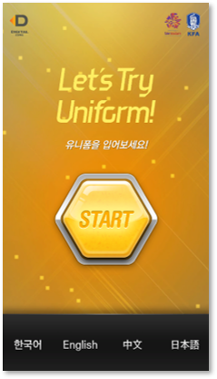</img>   
**소개**   
여러국가의 축구팀 유니폼을 Kinect를 사용한 모션캡처 방식을 사용하여   
피팅해볼 수 있는 서비스입니다. 3D/2D 2가지의 피팅모드를 지원합니다.

- **참여 파트** :   
2D 모드 UI 개발(**NGUI**), 유니폼 **XML** 데이터 작성/파싱   
파트를 맡아서 참여하였습니다.   
해당 서비스와 기존에 서비스 중이던 풋볼팬타지움 서비스의   
유지보수 업무또한 병행하여 진행하였습니다.

### 전형지원 시험 프로그램
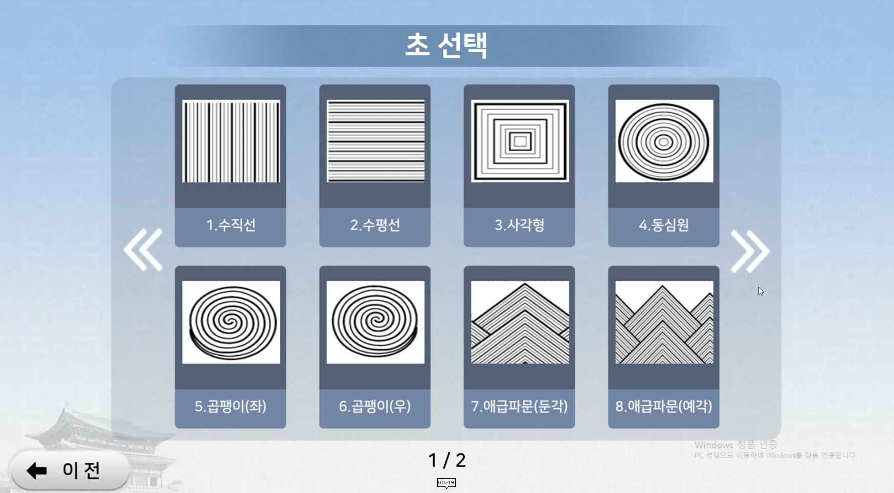</img>   
**소개**   
전통문화 사업 초 그리기 전형 시험 지원 프로그램입니다.

- **참여 파트** :   
협력업체 **DLL 모듈 연동**, 프로그램 전체 UI개발(**UGUI**)   
파트를 맡아서 참여하였습니다.   
전통문화 대학 시험 진행당시 프로그램을 설치하고   
시험을 보조하는 업무를 병행하였습니다.   

### 전형지원 시험 결과 뷰어 프로그램
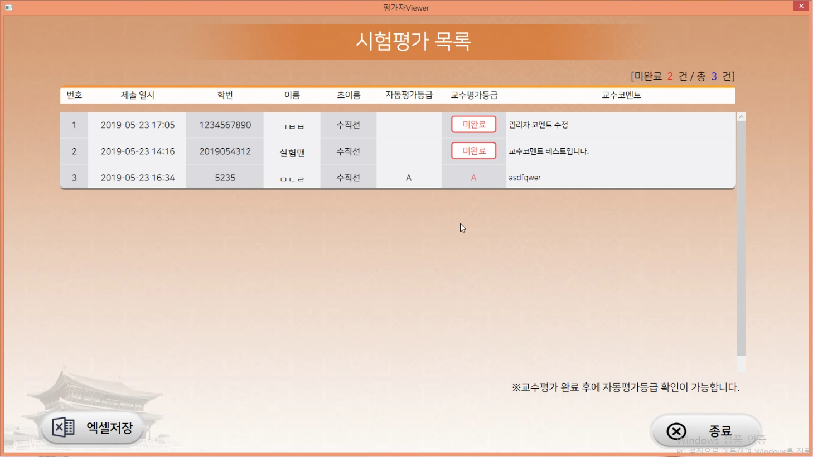</img>   
**소개**   
전통문화 사업 관리자용 시험 결과 관리자 뷰어 프로그램입니다.

- **참여 파트** :   
**WPF/MVVM** 패턴을 사용한 프로그램 전체 UI 개발, **TEXT 오픈 소스   
라이브러리** 연동 파트를 맡아서 참여하였습니다.   
전통문화 대학 시험 진행당시 산출된 시험결과를 관리자가 확인할 수   
있도록 설치하고 보조하는 업무를 병행하였습니다.

## 개인/팀 프로젝트
### ProejctPocket
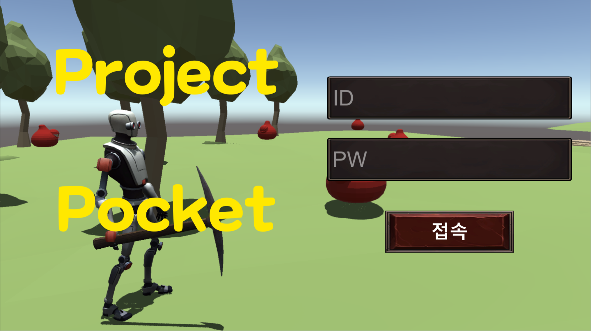</img>
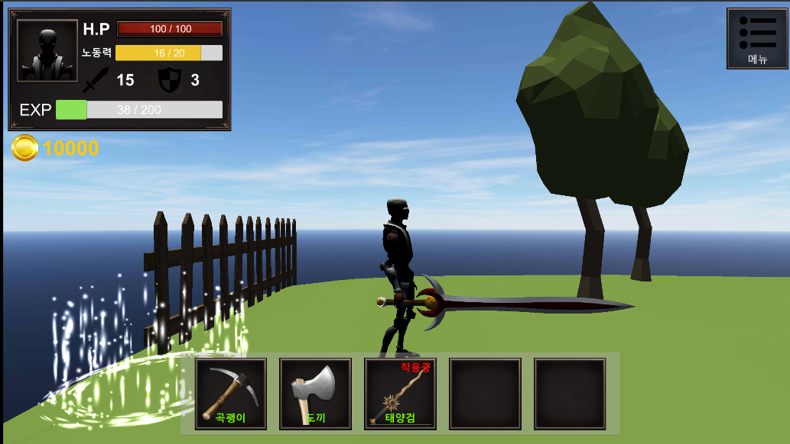</img>   
[Github 저장소](https://github.com/CBorange/ProjectPocket)   
[Youtube](https://www.youtube.com/watch?v=OsQzUh0tzYc&t=54s)   
[소개 PDF](https://drive.google.com/file/d/1FJix5ud8q9E7WiXRBhIK7230BgnX1NP-/view?usp=sharing)

**소개**   
3D RPG/어드벤처 장르의 게임입니다.   
전투/채집/퀘스트 등 생활컨텐츠 위주의 게임입니다.   

- **개발 기간** : 2020.03~2020.06 (약 3개월)
- **개발 인원** : 1인 개발
- **핵심 기술** : Unity3D, MSSQL, ObjectPooling, 디자인패턴, JSON,   
Coroutine/Task 비동기 처리

### ChatProgram
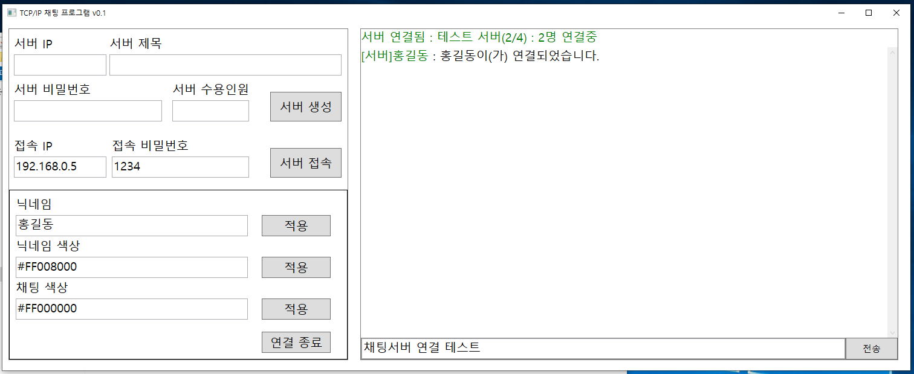</img>
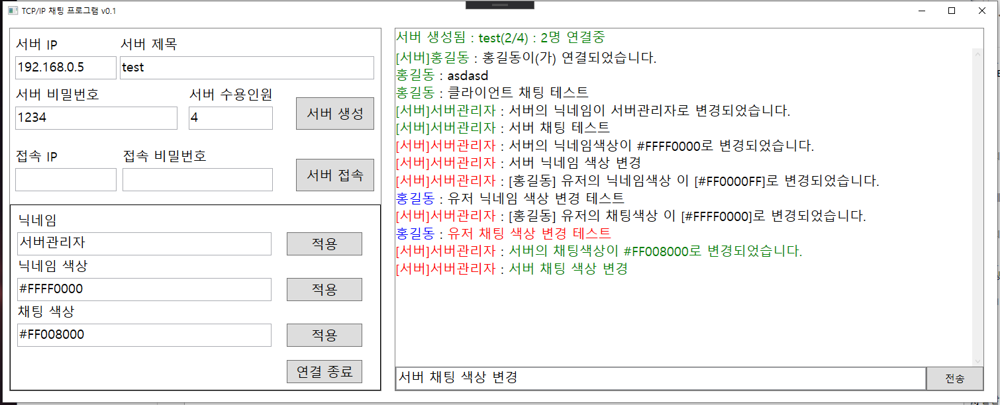</img>   
[Github 저장소](https://github.com/CBorange/ChatProgram)   

**소개**   
네트워크 프로그래밍 연습을 위하여 개발한 채팅 프로그램입니다.   
TCP/IP 소켓 기능을 사용하여 개발하였으며, 1:N 통신을 지원합니다.   

- **개발 기간** : 2020.03~2020.03 (약 3주)
- **개발 인원** : 1인 개발
- **핵심 기술** : WPF, MVVM, Socket Programing, 자체 통신 프로토콜 개발

### 펭귄그라운드
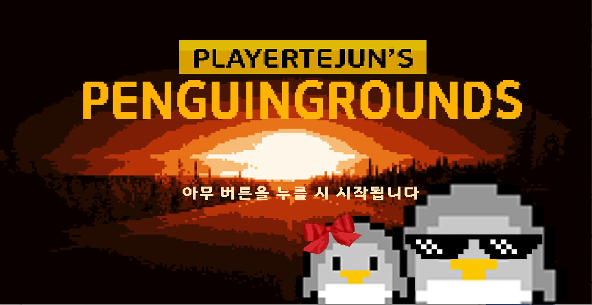</img>
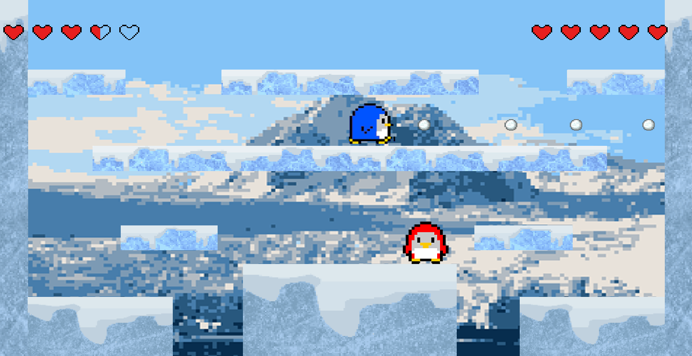</img>   
[Github 저장소](https://github.com/CBorange/PenguinGround)   
[Youtube](https://www.youtube.com/watch?v=yNLL3UpdCtE)

**소개**   
팀 프로젝트로 개발한 2D 플랫포머 대전 슈팅게임입니다.   
각 플레이어는 서로에게 눈덩이를 발사하여 먼저 쓰러뜨리면 승리하는 게임입니다.
- **개발 기간** : 2017.09~10 (약 1개월)
- **개발 인원** : 3명
- **참여 파트** :   
프로그래밍의 모든 파트를 맡아서 개발에 참여하였습니다.   
**DirectX**를 사용하여 개발되었으며, Unity 구현 방식을 참고하여   
간단한 **프레임워크**를 제작하여 개발하였습니다.
- **핵심 기술** : WinAPI, DirectX9, 게임 프레임워크 개발, ObjectPooling

### MimePark
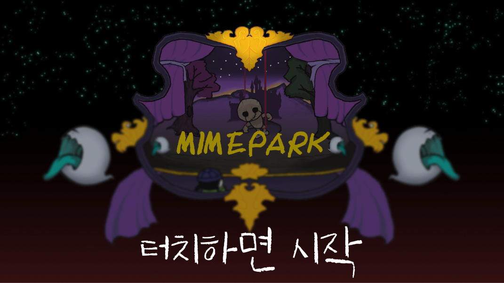</img>
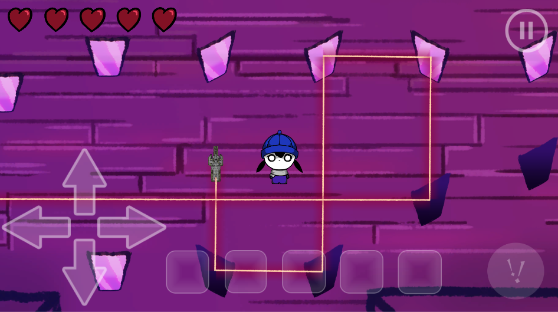</img>   
[Github 저장소](https://github.com/CBorange/MimePark)   
[Youtube](https://www.youtube.com/watch?v=VbJTDTyi_pg)

**소개**   
넷마블 게임 아카데미 2기에 참여하여 개발한 게임입니다.   
퍼즐/탈출 게임으로, 스토리 진행, 거울 반사 퍼즐을 해결하여 탈출하는 게임입니다.   
- **개발 기간** : 2017.05~2017.11 (약 6개월)
- **개발 인원** : 4명
- **참여 파트** :   
프로그래밍의 모든 파트를 맡아서 개발에 참여하였습니다.   
UGUI를 사용한 UI 개발, **JSON 파싱**을 이용한 대화 스크립트 로드   
**플레이어 추적 AI** 등의 기능을 개발하였습니다.
- **핵심 기술** : Unity3D, JSON, ObjectPooling

